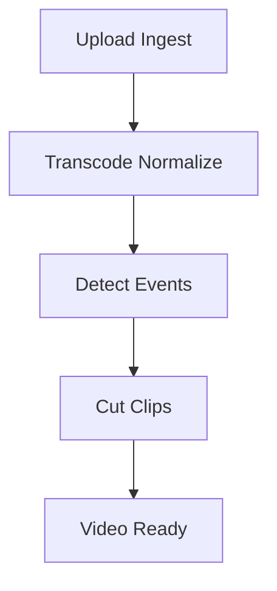

# Pipeline de Procesamiento (Versión 0.1)

## Etapas (actual)

1. upload_ingest: Registrar video y marcar processing.
2. transcode_normalize: Normalizar formato interno (simulado).
3. detect_events: Placeholder para extracción de eventos.
4. cut_clips: Generar segmentos heurísticos y marcar video ready.

## Próximas Etapas (planeado)

- generate_thumbnail
- transcribe_whisper
- highlight_rank
- seo_enrich
- publish_youtube
- analytics_pull

## Estados Job

queued → running → (success | failed[→queued si retries < max])

## SLA inicial (orientativo)

| Etapa         | Objetivo         |
| ------------- | ---------------- |
| ingest        | < 5s             |
| transcode     | < duración_video |
| detect_events | < 0.2x duración  |
| cut_clips     | < 5s             |

## TODO

- Persistir features de eventos
- Añadir locking distribuido (cuando haya múltiples workers)
- Métricas (duración por etapa, % reintentos)
